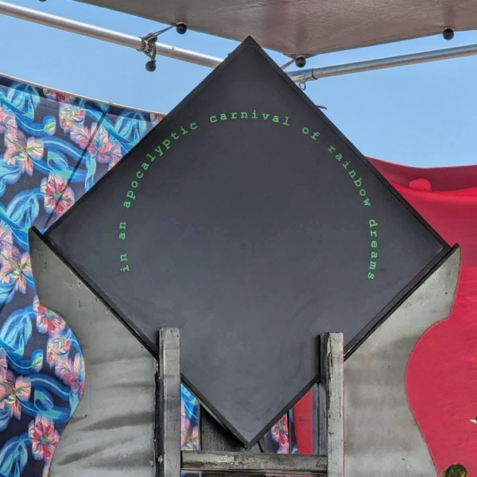

<p align="center"></p>

# Introduction

It's about time...

"Time is not what you think it is.  People assume that time is a strict progression of cause to effect, but actually
 from a non-linear, non-subjective viewpoint, it's more like a big ball of wibbly wobbly time-y wimey... stuff."

And that's the problem.  Any clock will tell you what time it is from a strictly Newtonian perspective.  But... time 
and space and information are intimately twisted about.  Events can occasionally precede their causes and the past can
be edited. In a sense, the future and past don't exist, and yet we live as though they do.  And in yet another sense, the
future and past have already existed and always will in a strange realm of potential.  The terms "elsewhere" and "elsewhen"
take on different meanings according to our lives, our paths, and even our moods.  There are people in your life whom you
may have just met and yet know them as though you've known them all their lives.  You remember events that you could not
possibly have attended with perfect clarity as though they just happened.  People who have long passed or who are yet to
be are still with you in every moment.

There's nothing wrong with your mind.  That's just how time is.  And this clock will help you make sense of it.

First, please note that it's impossible to keep accurate time with this device.  Look to your normal clock for that.
Not only is this device inherently (and often shockingly) inaccurate from a linear time perspective, but even the
interval at which it updates itself is more-or-less random.  Sometimes the messages are nonsensical.  Sometimes they
are shockingly prescient.  And sometimes this clock will lie to you.

This device knows many things but may only choose to tell you a few of them.  It understands and tracks... 

- the positions and motions of the sun and moon and planets and stars
- the workings of many different calendars including: Gregorian, Hebrew, Chinese, Martian, Indian National, Arabic, and many others
- It may decide to cast an I-Ching reading, draw a card from a divination deck, shake a magic 8-ball, or throw runestones
- It may give you positional references to any one of many thousands of different places, real and imagined
- Or temporal references to many thousands of different past or future events
- Its database contains many many thousands of holidays, anniversaries, and important times
- It may give you instructions or give you a quest to go on
- It also knows tens of thousands of book and movie quotes and song lyrics and random sayings

## Thanks to...

This didn't happen in a vacuum and it certainly draws on the work of others.  Rather a lot of others, particularly
for the content of the databases.  Maybe I referenced you?  To find a particular author, musician, artist, or other
quotable individual, go to the [attribution file](./data/attrib.txt)
and search for a name (or just scroll down to something interesting).  The four digit number that precedes it is an
attribution reference in one or more of the data files.  For instance, to find something that John Muir said, search
for "John Muir" in the attrib.txt file and find his number (0570, in case you're lazy).  Then go to the r_anys.txt
file and find all instances of " 0570".  And those are his quotes that I used (possibly not an exact quote, due to
formatting limitations).

# Subjective Time

This is the code for the Subjective Time art project.  Originally brought to the playa in 2009, then ported to 
Pebble in 2012.  Then shelved for a good eight years before being revived, completely re-thought and re-written, 
and then brought BACK to Burning Man in 2025.  The goal for this project (as of 02026-04) is to come up with an 
implementation for ESP32-based open-source smart watches.  And there are code snippets in the sandbox to support
that.

The python code is rough (this was my 2020, I-need-to-learn-python project) but should be sufficiently documented.  
For any future implementation, I want to use the same common set of data files.  Do NOT mess with the format of 
the data files.  They're pretty sensitive to modification, since everything's adderessed by counting bytes.

For a better explanation of the project in general, refer to the /data/attrib.txt file.  This serves as an embedded 
readme file that must travel with the code and provides an expanation of the references for the called-out lines in 
the data files.  Individual sub-directories may have their own readmes in order to explain the file formats.  Also 
of course, read the code comments.

And if you want to contribute to the code or data, please for the love of all that is holy, make your own fuckin' 
branch.  Thanks!

## General rules for all data files

- Only ASCII encoding is allowed.  The system cannot render UTF-anything characters.  Sorry/not-sorry.
- All messages are to be displayed using ONLY lowercase characters (the silly exception: CAPSLOCK DAY).
- Only the following punctuation is allowed in messages: "?", "!", "-", "'", "..." (3 periods, not a single-character elipsis).
- Use the forward-slash ("/") to force a line-break in a message.
- If punctuation is at the end of a line, use a space and force-break (" /") after it.  As an example:
  
``` you need an example? /here's an example of this! / ~~~~~~~~ ```

- Note the line length limitations of each file.  Use a tilde ("~") as a null character to pad to that length.
- Follow all of the rules in the READMEs in each of the data file directories.

## Python code construction and use

This is python so this is an easy one.  First you'll need a python 3.10 (or later) environment on whatever machine 
you use.  I've tested this on Windows 10/11 and Ubuntu 24.x.  It should be fine anywhere since there's nothing 
particularly platform dependant in the code.  The potential exception to what I just said: I do make use of Tkinter 
for graphics and that may not be appropriate if you're wanting to run this in an embedded system.  All of the graphics 
calls are isolated to the App class in app_main.  So that said, after you have a python environment installed...

- Download the entire project and uncompress it to wherever you want it.
- Make sure that the directory structure is just like it appears in this repository.
- Make sure that the values in the init file (/data/config.ini) look good to you, particularly:
  - lat = 40.78611 (this should be set to your current latitude)
  - lon = -119.204595 (and this one to your current longitude)
  - tz = 134 (the one-based line number of your current timezone in the /data/all_rgn.txt file)
  - tz_off = -700 (the current time offset from GMT in <+/->HHMM format)
  - debug = True (if true, then the message changes every 10-ish seconds for debugging)
  - playa = True (if true, then Burning Man messages are displayed)
  - img_dir = image_1920_45/ (pick out the directory that matches your screen)
- To start the clock, go to a console in the project directory and type: ```` python __init.py__ ````
- There will likely be some errors and some missing libraries, so fix those.
- For Windows, there's an auto-run batch file.  To have this run on startup, put a link to that file in the startup directory.

Oh, and python libraries you'll need (just do a pip install and you'll be fine):

- numpy
- Pillow (python imaging libary)
- python-dateutil
- juliandate
- suntime
- ephem

Finally, for debugging purposes, there are two useful functions in the app_parser.py file: return_everything()
and return_particular().  The first returns everything possible for the given date/time (the first few variables
defined in the function).  The second returns the results of parsing a particular string.  Just go to the end of 
the file and uncomment one or the other and then call app_parser.py directly from your python environment.  But
be sure to re-comment them before using the clock as a clock (it makes a mess otherwise).

That's about it.  If you are passingly familiar with python, it should be straightforward.  If not... then do 
that first I guess?
